# Diagramme de Classes — BIAT IT Billing Agent

```mermaid
classDiagram

%% ══════════════════════════════════════════════
%%  ÉNUMÉRATIONS
%% ══════════════════════════════════════════════

class InvoiceStatus {
    <<enumeration>>
    RECEIVED
    EXTRACTING
    EXTRACTED
    CLASSIFYING
    CLASSIFIED
    VALIDATING
    VALIDATED
    FLAGGED
    ESCALATED
    EXPORTING
    EXPORTED
    JOURNALED
    PAID
    COLLECTED
    REJECTED
    ERROR
    EXTRACTION_FAILED
}

class InvoiceDirection {
    <<enumeration>>
    SUPPLIER
    CLIENT
    UNKNOWN
}

class ChargeType {
    <<enumeration>>
    OPEX
    CAPEX
}

class FlagSeverity {
    <<enumeration>>
    ERROR
    WARNING
}

class FlagType {
    <<enumeration>>
    TOTAL_MISMATCH
    TVA_MISMATCH
    MISSING_FIELD
    INVALID_TAX_ID
    LOW_CONFIDENCE
    DUPLICATE
    NEAR_DUPLICATE
    HIGH_VALUE
    UNKNOWN_DIRECTION
    CATALOG_NO_MATCH
}

class ClientInvoiceStatus {
    <<enumeration>>
    DRAFT
    SENT
    PAID
    CANCELLED
}

class ExtractionMethod {
    <<enumeration>>
    NATIVE_PDF_LLM
    OCR_LLM
    RULES
}

%% ══════════════════════════════════════════════
%%  MODÈLE FACTURE FOURNISSEUR
%% ══════════════════════════════════════════════

class ConfidenceField~T~ {
    +T value
    +float confidence
    +str source
}

class LineItem {
    +int line_number
    +str description
    +float quantity
    +float unit_price
    +float line_total
    +float tva_rate
}

class ValidationFlag {
    +FlagType flag_type
    +FlagSeverity severity
    +str field_name
    +str message
    +bool resolved
    +datetime resolved_at
    +str resolved_by
}

class InvoiceRecord {
    +UUID id
    +str file_hash
    +str raw_file_path
    +InvoiceDirection direction
    +InvoiceStatus status
    +ExtractionMethod extraction_method
    +ConfidenceField~str~ issuer_name
    +ConfidenceField~str~ issuer_tax_id
    +ConfidenceField~str~ recipient_name
    +ConfidenceField~str~ invoice_number
    +ConfidenceField~date~ invoice_date
    +ConfidenceField~float~ amount_ht
    +ConfidenceField~float~ tva_rate
    +ConfidenceField~float~ tva_amount
    +ConfidenceField~float~ amount_ttc
    +str currency
    +str cost_catalog_id
    +str accounting_compte
    +ChargeType charge_type
    +bool human_review_required
    +datetime received_at
    +datetime paid_at
    +bool has_errors()
    +bool has_warnings()
    +add_flag(flag ValidationFlag)
}

%% ══════════════════════════════════════════════
%%  CATALOGUE COMPTABLE
%% ══════════════════════════════════════════════

class CostCatalogEntry {
    +str id
    +str label
    +str compte
    +float tva_rate
    +ChargeType charge_type
    +list~str~ keywords
}

class CostCatalog {
    +list~CostCatalogEntry~ entries
    +from_yaml(path str)$ CostCatalog
    +match(text str, flux ChargeFlux) CostCatalogEntry
    +get(entry_id str) CostCatalogEntry
    +all_entries() list~CostCatalogEntry~
}

%% ══════════════════════════════════════════════
%%  JOURNAL COMPTABLE
%% ══════════════════════════════════════════════

class JournalLine {
    +str compte
    +str libelle
    +float debit
    +float credit
}

class JournalEntry {
    +UUID id
    +str reference
    +date date_ecriture
    +str description
    +UUID source_invoice_id
    +UUID source_asset_id
    +float total_debit()
    +float total_credit()
    +bool is_balanced()
}

%% ══════════════════════════════════════════════
%%  IMMOBILISATIONS (CAPEX)
%% ══════════════════════════════════════════════

class Asset {
    +UUID id
    +str designation
    +str compte_immobilisation
    +str compte_amortissement
    +date acquisition_date
    +float acquisition_cost_ht
    +int useful_life_years
    +str depreciation_method
    +UUID supplier_invoice_id
    +float annual_depreciation()
    +float monthly_depreciation()
    +float book_value_at(ref_date date)
}

%% ══════════════════════════════════════════════
%%  FACTURATION CLIENT
%% ══════════════════════════════════════════════

class ClientLineItem {
    +str description
    +float quantity
    +float unit_price
    +float line_total
    +float tva_rate
    +float tva_amount
    +str compte_produit
    +str charte_reference
    +str phase_id
}

class ClientInvoice {
    +UUID id
    +str invoice_number
    +date invoice_date
    +date due_date
    +str issuer_name
    +str issuer_tax_id
    +str client_id
    +str client_name
    +str client_tax_id
    +float amount_ht
    +float tva_amount
    +float amount_ttc
    +ClientInvoiceStatus status
    +str source_template_id
    +datetime sent_at
    +datetime paid_at
    +str currency
    +bool is_export
    +str domiciliation_bank
    +str domiciliation_number
    +date shipment_date
    +date repatriation_deadline
    +date repatriation_date
    +str payment_guarantee_type
    +float foreign_currency_amount
    +float exchange_rate
}

%% ══════════════════════════════════════════════
%%  PROJETS & CHARTES
%% ══════════════════════════════════════════════

class CharteProjet {
    +str id
    +str project_id
    +str project_name
    +str client
    +date valid_from
    +date valid_until
    +float budget_jh
    +float taux_jh
    +bool is_active
}

class Phase {
    +str id
    +str project_id
    +str name
    +str description
    +float planned_jh
    +float consumed_jh
    +str status
    +date closed_date
    +list livrables
}

class AssetProjectLink {
    +str asset_id
    +str project_id
    +float allocation_pct
}

%% ══════════════════════════════════════════════
%%  UTILISATEURS & SÉCURITÉ
%% ══════════════════════════════════════════════

class User {
    +UUID id
    +str nom
    +str prenom
    +str email
    +str hashed_password
    +str role
    +str departement
    +bool is_first_login
    +bool is_active
    +bool is_demo
    +datetime created_at
}

class AuditLog {
    +UUID id
    +datetime created_at
    +str user_id
    +str user_email
    +str user_role
    +str action
    +str resource_type
    +str resource_id
    +JSON before_value
    +JSON after_value
    +str ip_address
    +str user_agent
    +str status
}

%% ══════════════════════════════════════════════
%%  NOTIFICATIONS
%% ══════════════════════════════════════════════

class Notification {
    +UUID id
    +str type
    +str title
    +str body
    +bool is_read
    +datetime created_at
    +UUID invoice_id
}

%% ══════════════════════════════════════════════
%%  PROJETS — LIVRABLES & BUDGET
%% ══════════════════════════════════════════════

class Livrable {
    +UUID id
    +str phase_id
    +str titre
    +str description
    +date date_livraison_prevue
    +date date_livraison_reelle
    +str statut
    +str created_by
    +datetime created_at
}

class LigneBudget {
    +UUID id
    +str projet_id
    +str categorie
    +float montant_prevu
    +float montant_consomme
    +str devise
    +datetime created_at
}

class FeuilleDeRoute {
    +UUID id
    +str titre
    +str description
    +date date_debut
    +date date_fin
    +str statut
    +str priorite
    +int annee
    +str responsable
    +datetime created_at
}

%% ══════════════════════════════════════════════
%%  PAIEMENTS & ÉCHÉANCIER (Beanie — Module 5)
%% ══════════════════════════════════════════════

class PaymentDocument {
    +UUID id
    +UUID invoice_id
    +float amount
    +date payment_date
    +str payment_reference
    +str payment_method
    +datetime created_at
}

class PaymentInstallmentDocument {
    +UUID id
    +str invoice_id
    +int installment_number
    +int total_installments
    +float base_amount
    +float current_amount
    +date due_date
    +date paid_date
    +float paid_amount
    +str status
    +int late_periods
    +datetime created_at
    +datetime updated_at
}

%% ══════════════════════════════════════════════
%%  RISQUES (Beanie — Module 7)
%% ══════════════════════════════════════════════

class RisqueDocument {
    +UUID id
    +str titre
    +str description
    +str type_risque
    +str probabilite
    +str impact
    +str niveau_criticite
    +str statut
    +str plan_mitigation
    +str responsable_id
    +date date_identification
    +date date_echeance_mitigation
    +date date_cloture
    +UUID feuille_route_id
    +str projet_id
}

%% ══════════════════════════════════════════════
%%  BUDGET ANNUEL (Beanie — Module 8)
%% ══════════════════════════════════════════════

class BudgetPlanDocument {
    +UUID id
    +str catalog_id
    +int year
    +str label
    +list~float~ monthly
    +str note
    +datetime updated_at
}

%% ══════════════════════════════════════════════
%%  FEEDBACK DE CLASSIFICATION (Beanie — Module 1, boucle ML)
%% ══════════════════════════════════════════════

class ClassificationFeedbackDocument {
    +UUID id
    +str invoice_id
    +str original_compte
    +str corrected_compte
    +str original_catalog_id
    +str corrected_catalog_id
    +str invoice_text
    +str corrected_by
    +datetime corrected_at
}

%% ══════════════════════════════════════════════
%%  RELATIONS
%% ══════════════════════════════════════════════

%% InvoiceRecord composition
InvoiceRecord "1" *-- "0..*" LineItem : contient
InvoiceRecord "1" *-- "0..*" ValidationFlag : a
InvoiceRecord "1" *-- "6" ConfidenceField~T~ : champs extraits

%% Enums
InvoiceRecord --> InvoiceStatus : status
InvoiceRecord --> InvoiceDirection : direction
InvoiceRecord --> ChargeType : charge_type
InvoiceRecord --> ExtractionMethod : extraction_method
ValidationFlag --> FlagType : flag_type
ValidationFlag --> FlagSeverity : severity
ClientInvoice --> ClientInvoiceStatus : status

%% Catalogue
CostCatalog "1" o-- "1..*" CostCatalogEntry : regroupe
InvoiceRecord --> CostCatalogEntry : classifiée selon

%% Journal
JournalEntry "1" *-- "2..*" JournalLine : équilibre
JournalEntry --> InvoiceRecord : source_invoice_id
JournalEntry --> Asset : source_asset_id

%% CAPEX
Asset --> InvoiceRecord : supplier_invoice_id
Asset "N" -- "M" CharteProjet : AssetProjectLink

%% Facturation client
ClientInvoice "1" *-- "1..*" ClientLineItem : détail
ClientInvoice --> CharteProjet : référence projet

%% Projets
CharteProjet "1" *-- "1..*" Phase : décomposée en
Phase "1" *-- "0..*" Livrable : contient
CharteProjet "1" o-- "0..*" LigneBudget : budget par catégorie

%% Sécurité & audit
AuditLog --> User : tracé par
Notification --> InvoiceRecord : déclenché par

%% Paiements & échéancier
PaymentDocument --> InvoiceRecord : invoice_id
InvoiceRecord "1" *-- "0..*" PaymentInstallmentDocument : échéances

%% Risques
RisqueDocument --> FeuilleDeRoute : feuille_route_id
RisqueDocument --> CharteProjet : projet_id

%% Budget annuel
BudgetPlanDocument --> CostCatalogEntry : catalog_id

%% Feedback de classification
ClassificationFeedbackDocument --> InvoiceRecord : invoice_id
```

## Légende

| Notation | Signification |
|----------|---------------|
| `*--` | Composition (cycle de vie lié) |
| `o--` | Agrégation (indépendant) |
| `-->` | Association / dépendance |
| `<<enumeration>>` | Énumération |
| `~T~` | Type générique |

## Description des modules

| Module | Classes principales | Rôle |
|--------|---------------------|------|
| **Extraction** | `InvoiceRecord`, `ConfidenceField`, `LineItem` | Stocke les données extraites avec leur score de confiance |
| **Validation** | `ValidationFlag` | Signale les anomalies (math, champs manquants, doublons) |
| **Classification** | `CostCatalogEntry`, `CostCatalog` | Associe chaque facture à un compte PCE et une nature de charge |
| **Comptabilité** | `JournalEntry`, `JournalLine` | Génère les écritures en partie double (PCE Tunisien) |
| **CAPEX** | `Asset`, `AssetProjectLink` | Registre des immobilisations et plan d'amortissement |
| **Facturation** | `ClientInvoice`, `ClientLineItem` | Factures émises aux entités du groupe BIAT |
| **Échéancier & Paiements** | `PaymentDocument`, `PaymentInstallmentDocument` | Paiements reçus et plan de paiement échelonné avec pénalités de retard |
| **Projets** | `CharteProjet`, `Phase`, `Livrable`, `LigneBudget` | Suivi des projets IT : phases, livrables, budget par catégorie |
| **Feuille de route** | `FeuilleDeRoute` | Jalons stratégiques 2026 avec statut et priorité |
| **Risques** | `RisqueDocument` | Risques projet : probabilité, impact, criticité, plan de mitigation |
| **Budget annuel** | `BudgetPlanDocument` | Plan budgétaire par entrée catalogue et année (12 valeurs mensuelles) |
| **Utilisateurs** | `User` | Comptes avec rôles, profil modifiable, premier login |
| **Audit** | `AuditLog` | Piste d'audit BCT : chaque action enregistrée avec before/after |
| **Notifications** | `Notification` | Alertes automatiques sur factures bloquées ou budgets dépassés |
| **Feedback classification** | `ClassificationFeedbackDocument` | Corrections humaines de compte comptable, utilisées pour le réentraînement ML |
| **BCT Compliance** | `ClientInvoice` | Champs export : devise, domiciliation, délai de rapatriement |
