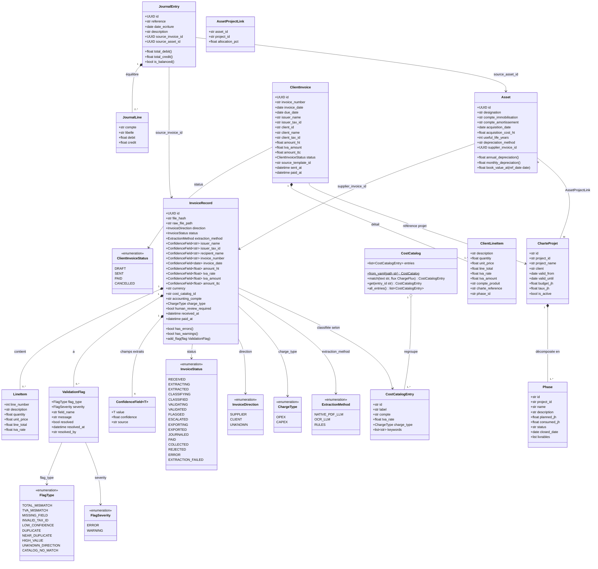

# Diagramme de Classes — BIAT IT Billing Agent

## Légende

| Notation | Signification |
|----------|---------------|
| `*--` | Composition (cycle de vie lié) |
| `o--` | Agrégation (indépendant) |
| `-->` | Association / dépendance |
| `<<enumeration>>` | Énumération |
| `~T~` | Type générique |

## Description des modules

| Module | Classes principales | Rôle |
|--------|---------------------|------|
| **Extraction** | `InvoiceRecord`, `ConfidenceField`, `LineItem` | Stocke les données extraites avec leur score de confiance |
| **Validation** | `ValidationFlag` | Signale les anomalies (math, champs manquants, doublons) |
| **Classification** | `CostCatalogEntry`, `CostCatalog` | Associe chaque facture à un compte PCE et une nature de charge |
| **Comptabilité** | `JournalEntry`, `JournalLine` | Génère les écritures en partie double (PCE Tunisien) |
| **CAPEX** | `Asset`, `AssetProjectLink` | Registre des immobilisations et plan d'amortissement |
| **Facturation** | `ClientInvoice`, `ClientLineItem` | Factures émises aux entités du groupe BIAT |
| **Projets** | `CharteProjet`, `Phase` | Suivi des projets IT par jalons et jours/homme |
