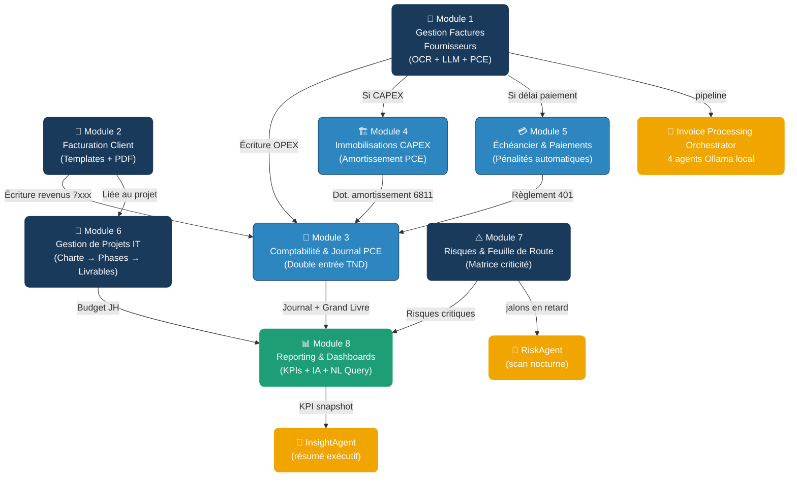

# Diagram 2 — Functional Architecture
# Paste into Eraser → New Diagram → Flowchart

```mermaid
flowchart TB
  classDef module fill:#1A3A5C,color:#fff,stroke:#1A3A5C,rx:8
  classDef flow fill:#2E86C1,color:#fff,stroke:#2E86C1
  classDef ai fill:#F0A500,color:#fff,stroke:#F0A500,rx:8
  classDef report fill:#1D9E76,color:#fff,stroke:#1D9E76,rx:8

  M1["📄 Module 1\nGestion Factures\nFournisseurs\n(OCR + LLM + PCE)"]:::module
  M2["🧾 Module 2\nFacturation Client\n(Templates + PDF)"]:::module
  M3["📒 Module 3\nComptabilité & Journal PCE\n(Double entrée TND)"]:::module
  M4["🏗️ Module 4\nImmobilisations CAPEX\n(Amortissement PCE)"]:::module
  M5["💳 Module 5\nÉchéancier & Paiements\n(Pénalités automatiques)"]:::module
  M6["📂 Module 6\nGestion de Projets IT\n(Charte → Phases → Livrables)"]:::module
  M7["⚠️ Module 7\nRisques & Feuille de Route\n(Matrice criticité)"]:::module
  M8["📊 Module 8\nReporting & Dashboards\n(KPIs + IA + NL Query)"]:::report

  AI1["🤖 Invoice Processing Orchestrator\n4 agents Ollama local"]:::ai
  AI2["🤖 RiskAgent\n(scan nocturne)"]:::ai
  AI3["🤖 InsightAgent\n(résumé exécutif)"]:::ai

  M1 -->|"Écriture OPEX"| M3
  M1 -->|"Si CAPEX"| M4
  M1 -->|"Si délai paiement"| M5
  M2 -->|"Écriture revenus 7xxx"| M3
  M2 -->|"Liée au projet"| M6
  M4 -->|"Dot. amortissement 6811"| M3
  M5 -->|"Règlement 401"| M3
  M6 -->|"Budget JH"| M8
  M7 -->|"Risques critiques"| M8
  M3 -->|"Journal + Grand Livre"| M8
  M1 -->|"pipeline"| AI1
  M7 -->|"jalons en retard"| AI2
  M8 -->|"KPI snapshot"| AI3

  style M1 fill:#1A3A5C,color:#fff
  style M2 fill:#1A3A5C,color:#fff
  style M3 fill:#2E86C1,color:#fff
  style M4 fill:#2E86C1,color:#fff
  style M5 fill:#2E86C1,color:#fff
  style M6 fill:#1A3A5C,color:#fff
  style M7 fill:#1A3A5C,color:#fff
  style M8 fill:#1D9E76,color:#fff
```
