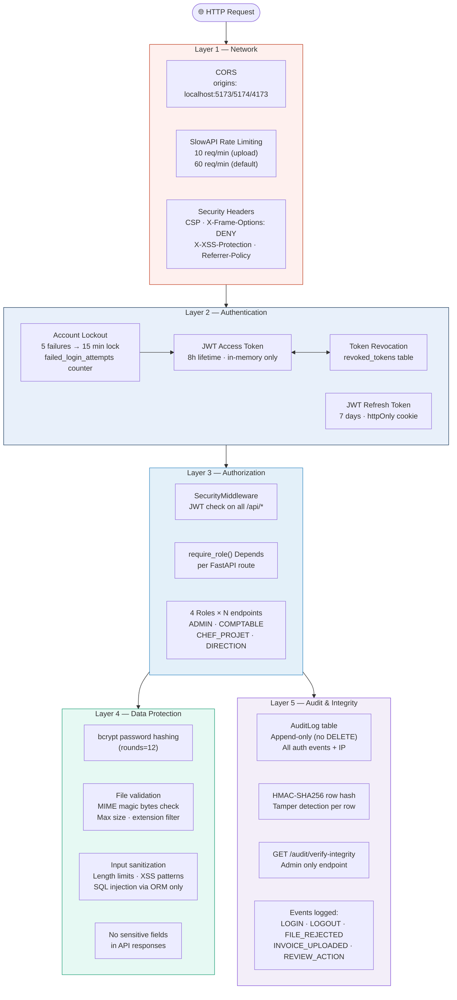

# Diagram 4 — Security Architecture
# Paste into Eraser → New Diagram → Flowchart

```mermaid
flowchart TB
  classDef layer1 fill:#C0391B,color:#fff,stroke:none
  classDef layer2 fill:#1A3A5C,color:#fff,stroke:none
  classDef layer3 fill:#2E86C1,color:#fff,stroke:none
  classDef layer4 fill:#1D9E76,color:#fff,stroke:none
  classDef layer5 fill:#804CD7,color:#fff,stroke:none

  Request(["🌐 HTTP Request"])

  subgraph L1["Layer 1 — Network"]
    CORS["CORS\norigins: localhost:5173/5174/4173"]
    Rate["SlowAPI Rate Limiting\n10 req/min (upload)\n60 req/min (default)"]
    Headers["Security Headers\nCSP · X-Frame-Options: DENY\nX-XSS-Protection · Referrer-Policy"]
  end

  subgraph L2["Layer 2 — Authentication"]
    JWT["JWT Access Token\n8h lifetime · in-memory only"]
    Refresh["JWT Refresh Token\n7 days · httpOnly cookie"]
    Revoke["Token Revocation\nrevoked_tokens table"]
    Lockout["Account Lockout\n5 failures → 15 min lock\nfailed_login_attempts counter"]
  end

  subgraph L3["Layer 3 — Authorization"]
    Middleware["SecurityMiddleware\nJWT check on all /api/*"]
    RequireRole["require_role() Depends\nper FastAPI route"]
    RBAC["4 Roles × N endpoints\nADMIN · COMPTABLE\nCHEF_PROJET · DIRECTION"]
  end

  subgraph L4["Layer 4 — Data Protection"]
    Bcrypt["bcrypt password hashing\n(rounds=12)"]
    FileVal["File validation\nMIME magic bytes check\nMax size · extension filter"]
    Sanitize["Input sanitization\nLength limits · XSS patterns\nSQL injection via ORM only"]
    NoLeak["No sensitive fields\nin API responses"]
  end

  subgraph L5["Layer 5 — Audit & Integrity"]
    AuditLog["AuditLog table\nAppend-only (no DELETE)\nAll auth events + IP"]
    HMAC["HMAC-SHA256 row hash\nTamper detection per row"]
    Verify["GET /audit/verify-integrity\nAdmin only endpoint"]
    Events["Events logged:\nLOGIN · LOGOUT · FILE_REJECTED\nINVOICE_UPLOADED · REVIEW_ACTION"]
  end

  Request --> L1 --> L2 --> L3 --> L4
  L3 --> L5
  JWT <--> Revoke
  Lockout --> JWT

  style L1 fill:#FEF0EE,stroke:#C0391B
  style L2 fill:#E8F0FA,stroke:#1A3A5C
  style L3 fill:#E3F0F9,stroke:#2E86C1
  style L4 fill:#E6F9F3,stroke:#1D9E76
  style L5 fill:#F3EEF9,stroke:#804CD7
```
