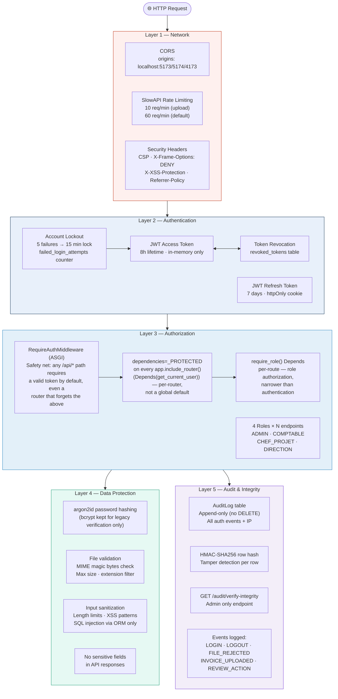

# Diagram 4 — Security Architecture

**Updated 2026-07-16** — Layer 4 said "bcrypt password hashing"; the actual
code (`backend/api/auth.py`) hashes new passwords with argon2id and only
uses bcrypt to verify pre-migration legacy hashes.

**Updated 2026-07-20**: Layer 3 named a single "SecurityMiddleware" node.
That was imprecise about the mechanism (corrected below), and an earlier
version of this note additionally overstated a related finding's severity
— corrected here too, since it was wrong: `GET /ai/health-summary` and
`POST /ai/suggest-mitigation` were **not** reachable by anonymous callers.
Every protected router is included in `api/main.py` via
`app.include_router(router, prefix="/api", dependencies=_PROTECTED)`
where `_PROTECTED = [Depends(get_current_user)]` — FastAPI applies that to
every route added through that call, confirmed live (`GET /api/kpi`, which
has no `Depends` of its own, correctly returns 401 unauthenticated). Both
routes already required a valid access token; the actual gap was narrower:
they were missing their own `require_role(...)`, so any authenticated user
of *any* role could call them, not just the intended ones — fixed
2026-07-20 (`backend/api/routers/ai.py`).

Real remaining gap, closed the same day: that per-router protection only
works if every `include_router()` call remembers `dependencies=_PROTECTED`
— nothing stops a future router from being added without it. Added
`RequireAuthMiddleware` (`api/security/auth_middleware.py`) as an ASGI-level
safety net: it runs before routing/dependency resolution, so it protects
any `/api/*` path by default — including a brand-new, entirely unprotected
router — regardless of whether that router's registration remembers the
parameter. It checks authentication only (valid, non-revoked token); role
authorization stays a per-route `require_role()` concern. See the updated
Layer 3 below.

# Paste into Eraser → New Diagram → Flowchart

