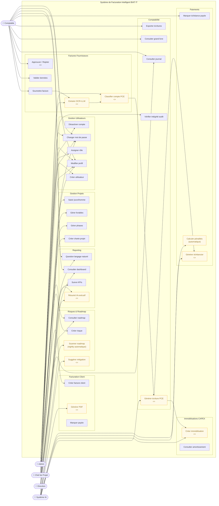

# Diagram 6 — Use Case Diagram
# Paste into Eraser → New Diagram → Flowchart (use as UML Use Case)

```mermaid
flowchart LR
  classDef actor fill:#1A3A5C,color:#fff,stroke:none,shape:circle
  classDef uc fill:#E3F0F9,color:#1A3A5C,stroke:#2E86C1
  classDef ai fill:#FEF9E7,color:#8B6914,stroke:#F0A500
  classDef sys fill:#F5F7FA,stroke:#1A3A5C

  ADMIN(["👤 Admin"])
  COMPTABLE(["👤 Comptable"])
  CHEF(["👤 Chef de Projet"])
  DIR(["👤 Direction"])
  IA(["🤖 Système IA"])

  subgraph SYS["Système de Facturation Intelligent BIAT IT"]
    subgraph GU["Gestion Utilisateurs"]
      UC_CU["Créer utilisateur"]
      UC_AR["Assigner rôle"]
      UC_DC["Désactiver compte"]
      UC_MP["Modifier profil"]
      UC_CPW["Changer mot de passe"]
    end

    subgraph FF["Factures Fournisseurs"]
      UC_SF["Soumettre facture"]
      UC_EX["Extraire OCR+LLM\n<<include>>"]:::ai
      UC_CL["Classifier compte PCE\n<<include>>"]:::ai
      UC_VD["Valider données"]
      UC_AR2["Approuver / Rejeter\n<<extend>>"]
    end

    subgraph COMPTA["Comptabilité"]
      UC_GE["Générer écriture PCE\n<<include>>"]:::ai
      UC_CJ["Consulter journal"]
      UC_GL["Consulter grand livre"]
      UC_EX2["Exporter écritures"]
      UC_VI["Vérifier intégrité audit"]
    end

    subgraph CAPEX["Immobilisations CAPEX"]
      UC_CI["Créer immobilisation\n<<extend>>"]:::ai
      UC_CA["Consulter amortissement"]
    end

    subgraph PAY["Paiements"]
      UC_GES["Générer échéancier\n<<include>>"]:::ai
      UC_PEN["Calculer pénalités\n(automatique)"]:::ai
      UC_PAY["Marquer échéance payée"]
    end

    subgraph FACTCLI["Facturation Client"]
      UC_FC["Créer facture client"]
      UC_PDF["Générer PDF\n<<include>>"]:::ai
      UC_PAY2["Marquer payée"]
    end

    subgraph PROJ["Gestion Projets"]
      UC_CP["Créer charte projet"]
      UC_PH["Gérer phases"]
      UC_LIV["Gérer livrables"]
      UC_JH["Saisir jours/homme"]
    end

    subgraph RISK["Risques & Roadmap"]
      UC_CR["Créer risque"]
      UC_MIT["Suggérer mitigation\n<<include>>"]:::ai
      UC_SCAN["Scanner roadmap\n(nightly automatique)"]:::ai
      UC_RD["Consulter roadmap"]
    end

    subgraph REP["Reporting"]
      UC_DB["Consulter dashboard"]
      UC_AI["Résumé IA exécutif\n<<include>>"]:::ai
      UC_NL["Question langage naturel"]
      UC_KPI["Suivre KPIs"]
    end
  end

  ADMIN --> UC_CU & UC_AR & UC_DC & UC_VI
  COMPTABLE --> UC_SF & UC_VD & UC_AR2 & UC_CJ & UC_GL & UC_EX2 & UC_PAY & UC_DB & UC_NL
  CHEF --> UC_FC & UC_CP & UC_PH & UC_LIV & UC_JH & UC_CR & UC_RD
  DIR --> UC_DB & UC_KPI & UC_NL & UC_AI & UC_RD & UC_CJ
  IA --> UC_EX & UC_CL & UC_GE & UC_CI & UC_GES & UC_PEN & UC_PDF & UC_MIT & UC_SCAN & UC_AI
  ADMIN & COMPTABLE & CHEF & DIR --> UC_MP & UC_CPW

  UC_SF --> UC_EX --> UC_CL --> UC_GE
  UC_GE --> UC_CI
  UC_GE --> UC_GES
```
