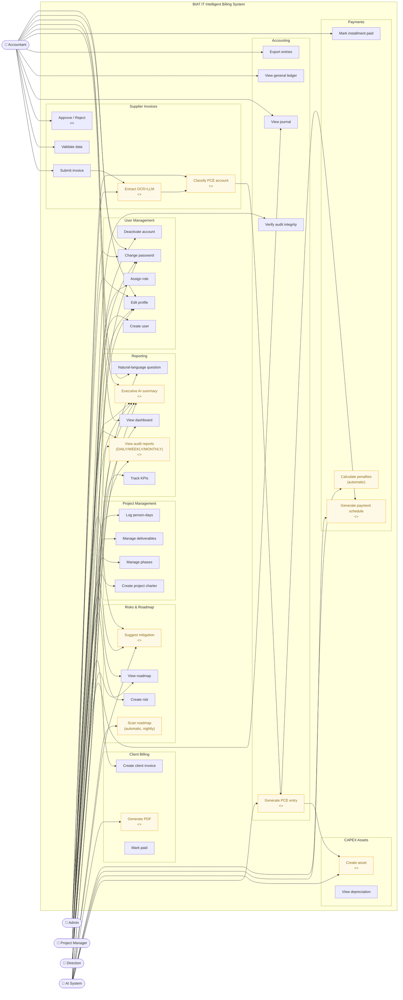

# Diagram 6 — Use Case Diagram

**Updated 2026-07-16/20** — translated to English, added the "View audit
reports" use case (Admin/Direction, AuditAgent), and fixed two role-mapping
gaps: "Executive AI summary" (`/ai/health-summary`) is reachable by all 4
roles, not just Direction; "Suggest mitigation" (`/ai/suggest-mitigation`)
is reachable by Chef de Projet/Admin directly, not only as an AI-internal
step. Both routes already required a valid login (via the router-level
`dependencies=_PROTECTED` in `api/main.py`) but were missing their own
`require_role(...)` — any authenticated user of any role could call them,
not the specific roles this diagram now shows — fixed 2026-07-20 (see
`backend/api/routers/ai.py`).

# Paste into Eraser → New Diagram → Flowchart (use as UML Use Case)

