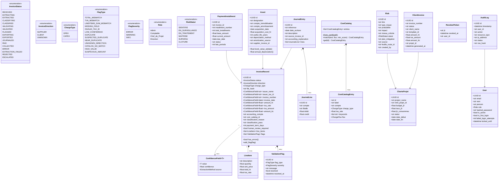

# Diagram 7 — Class Diagram
# Paste into Eraser → New Diagram → Class Diagram

```mermaid
classDiagram
  direction TB

  %% ── ENUMERATIONS ──────────────────────────────────────
  class InvoiceStatus {
    <<enumeration>>
    RECEIVED
    EXTRACTING
    EXTRACTED
    CLASSIFYING
    CLASSIFIED
    VALIDATING
    VALIDATED
    FLAGGED
    EXPORTING
    EXPORTED
    JOURNALED
    PAID
    COLLECTED
    ERROR
    EXTRACTION_FAILED
    REJECTED
    ESCALATED
  }

  class InvoiceDirection {
    <<enumeration>>
    SUPPLIER
    CLIENT
    UNKNOWN
  }

  class ChargeType {
    <<enumeration>>
    OPEX
    CAPEX
  }

  class FlagType {
    <<enumeration>>
    TOTAL_MISMATCH
    TVA_MISMATCH
    LINEITEMS_SUM_MISMATCH
    MISSING_FIELD
    INVALID_TAX_ID
    LOW_CONFIDENCE
    DUPLICATE
    SUSPECTED_DUPLICATE
    NEAR_DUPLICATE
    UNKNOWN_DIRECTION
    CATALOG_NO_MATCH
    HIGH_VALUE
    SUSPICIOUS_AMOUNT
  }

  class FlagSeverity {
    <<enumeration>>
    ERROR
    WARNING
    INFO
  }

  class Role {
    <<enumeration>>
    Admin
    Comptable
    Chef_de_Projet
    Direction
  }

  class RiskStatut {
    <<enumeration>>
    IDENTIFIE
    EN_SURVEILLANCE
    EN_TRAITEMENT
    MAITRISE
    SURVENU
    CLOTURE
  }

  %% ── CORE INVOICE ──────────────────────────────────────
  class ConfidenceField~T~ {
    +T value
    +float confidence
    +ExtractionMethod source
  }

  class LineItem {
    +str description
    +float quantity
    +float unit_price
    +float total_ht
    +float tva_rate
  }

  class ValidationFlag {
    +UUID id
    +FlagType flag_type
    +FlagSeverity severity
    +str message
    +bool resolved
    +datetime resolved_at
  }

  class InvoiceRecord {
    +UUID id
    +InvoiceStatus status
    +InvoiceDirection direction
    +ChargeType charge_type
    +str file_hash
    +ConfidenceField~str~ issuer_name
    +ConfidenceField~str~ issuer_tax_id
    +ConfidenceField~str~ invoice_number
    +ConfidenceField~date~ invoice_date
    +ConfidenceField~float~ amount_ht
    +ConfidenceField~float~ tva_rate
    +ConfidenceField~float~ tva_amount
    +ConfidenceField~float~ amount_ttc
    +str accounting_compte
    +str cost_catalog_id
    +str classification_reason
    +str classification_pass
    +int payment_term_days
    +bool human_review_required
    +list~LineItem~ line_items
    +list~ValidationFlag~ flags
    +bool has_errors()
    +add_flag(flag)
  }

  %% ── COST CATALOG ──────────────────────────────────────
  class CostCatalogEntry {
    +str id
    +str label
    +str compte
    +ChargeType charge_type
    +float tva_rate
    +list~str~ keywords
    +ChargeFlux flux
  }

  class CostCatalog {
    +list~CostCatalogEntry~ entries
    +from_yaml(path)$
    +match(text, flux, min_score) CostCatalogEntry
    +get(id) CostCatalogEntry
  }

  %% ── ACCOUNTING ───────────────────────────────────────
  class JournalLine {
    +UUID id
    +str compte
    +str libelle
    +float debit
    +float credit
  }

  class JournalEntry {
    +UUID id
    +str reference
    +date date_ecriture
    +str description
    +str source_invoice_id
    +str accounting_explanation
    +list~JournalLine~ lines
  }

  %% ── CAPEX ────────────────────────────────────────────
  class Asset {
    +UUID id
    +str designation
    +str compte_immobilisation
    +str compte_amortissement
    +date acquisition_date
    +float acquisition_cost_ht
    +int useful_life_years
    +str depreciation_method
    +str amortization_source
    +str supplier_invoice_id
    +float book_value_at(date)
    +float annual_depreciation()
  }

  %% ── PAYMENTS ─────────────────────────────────────────
  class PaymentInstallment {
    +UUID id
    +str invoice_id
    +int installment_number
    +int total_installments
    +float base_amount
    +float current_amount
    +date due_date
    +str status
    +int late_periods
  }

  %% ── CLIENT INVOICE ───────────────────────────────────
  class ClientInvoice {
    +UUID id
    +str invoice_number
    +str status
    +str client_name
    +str template_id
    +float amount_ht
    +float tva_amount
    +float amount_ttc
    +str projet_id
    +datetime generated_at
  }

  %% ── PROJECTS ─────────────────────────────────────────
  class CharteProjet {
    +UUID id
    +str project_name
    +str chef_projet_id
    +float budget_jh
    +float taux_jh
    +float jh_consommes
    +str statut
    +date date_debut
    +date date_fin
  }

  %% ── SECURITY ─────────────────────────────────────────
  class User {
    +UUID id
    +str email
    +str nom
    +str prenom
    +Role role
    +str hashed_password
    +bool is_active
    +bool is_first_login
    +int failed_login_attempts
    +datetime locked_until
  }

  class AuditLog {
    +UUID id
    +datetime timestamp
    +str user_id
    +str action
    +str resource_type
    +str ip_address
    +str status
    +str row_hash
  }

  class RevokedToken {
    +str jti
    +datetime revoked_at
    +str user_id
  }

  %% ── RISKS ────────────────────────────────────────────
  class Risk {
    +UUID id
    +str titre
    +str type_risque
    +str probabilite
    +str impact
    +str niveau_criticite
    +RiskStatut statut
    +str plan_mitigation
    +str source
    +str feuille_route_id
    +str created_by
  }

  %% ── RELATIONSHIPS ────────────────────────────────────
  InvoiceRecord "1" *-- "many" ValidationFlag
  InvoiceRecord "1" *-- "many" LineItem
  InvoiceRecord "1" --> "many" ConfidenceField~T~
  JournalEntry "1" *-- "many" JournalLine
  JournalEntry --> InvoiceRecord
  Asset --> InvoiceRecord
  PaymentInstallment --> InvoiceRecord
  CostCatalog "1" *-- "many" CostCatalogEntry
  ClientInvoice --> CharteProjet
  AuditLog --> User
  Risk --> CharteProjet
```
