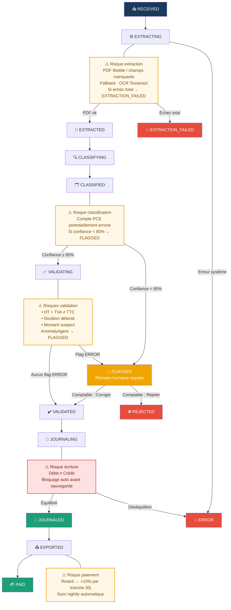

# Diagram 14 — Workflow : Statuts d'une Facture (avec indicateurs de risque)
# Paste into Eraser → New Diagram → Flowchart

## Transitions et risques

| Transition | Déclencheur | Risque | Mitigation |
|-----------|-------------|--------|------------|
| RECEIVED → EXTRACTING | Pipeline IA automatique | PDF illisible | Fallback OCR Tesseract |
| EXTRACTING → EXTRACTION_FAILED | OCR + LLM échouent | Critique — blocage | Rejet avec notification |
| CLASSIFIED → FLAGGED | Confiance < 85% | Compte PCE erroné | Révision humaine obligatoire |
| VALIDATING → FLAGGED | AnomalyAgent flag ERROR | Math / Doublon / Anomalie | File de révision comptable |
| JOURNALING → ERROR | Débit ≠ Crédit | Non-conformité PCE | Bloquage automatique avant DB |
| EXPORTED → PAID | Comptable marque payé | Retard de paiement | Pénalité +10%/30j, alertes nightly |
