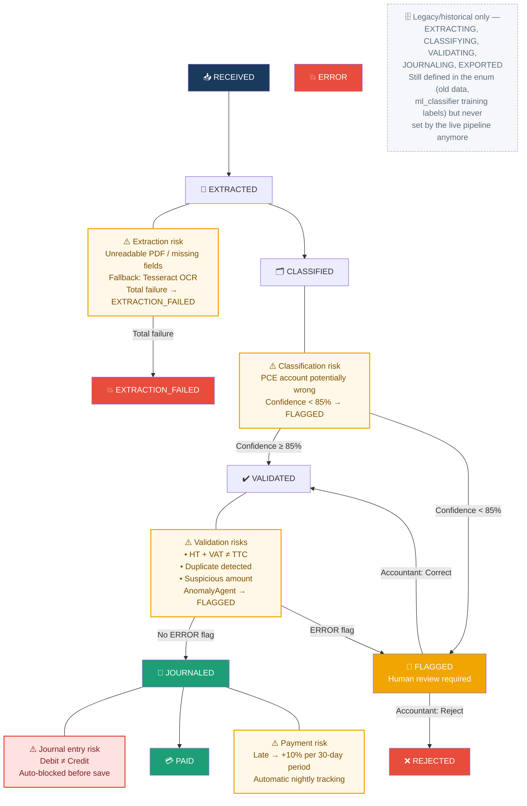

# Diagram 14 — Workflow: Invoice Status (with risk indicators)

**Updated 2026-07-16** — translated to English, and fixed a real
staleness: this diagram showed `EXTRACTING/CLASSIFYING/VALIDATING/
JOURNALING/EXPORTED` as states the live pipeline actually transitions
through. Per `CLAUDE.md` ("InvoiceStatus" state machine), the enum still
*defines* all of these (kept for historical/legacy-data reasons — see
Diagram 7), but `InvoiceProcessingOrchestrator.process_invoice()` — the only
live writer — never sets any `-ING` in-progress status and skips
`EXPORTING`/`EXPORTED` entirely (that was the deleted daemon's export
step). The real live path is `RECEIVED → EXTRACTED → CLASSIFIED →
VALIDATED (or FLAGGED) → JOURNALED`. This version marks the removed
states explicitly as legacy/historical rather than showing them as live
transitions — same fix already applied to Diagram 9.

# Paste into Eraser → New Diagram → Flowchart

## Transitions and risks

| Transition | Trigger | Risk | Mitigation |
|-----------|-------------|--------|------------|
| RECEIVED → EXTRACTED | Automatic AI pipeline | Unreadable PDF | Tesseract OCR fallback |
| EXTRACTED → EXTRACTION_FAILED | OCR + LLM both fail | Critical — blocked | Rejected with notification |
| CLASSIFIED → FLAGGED | Confidence < 85% | Wrong PCE account | Mandatory human review |
| VALIDATED → FLAGGED | AnomalyAgent ERROR flag | Math / duplicate / anomaly | Accounting review queue |
| VALIDATED → JOURNALED | AccountingAgent, no ERROR flag | PCE non-compliance if unbalanced | Auto-blocked before DB save |
| JOURNALED → PAID | Accountant marks paid | Late payment | +10%/30-day penalty, nightly alerts |
