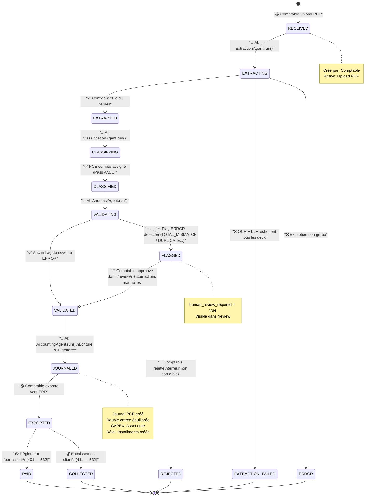

# Diagram 14 — Invoice Status State Machine
# Paste into Eraser → New Diagram → Flowchart

```mermaid
stateDiagram-v2
  [*] --> RECEIVED : "📤 Comptable upload PDF"

  RECEIVED --> EXTRACTING : "🤖 AI: ExtractionAgent.run()"
  EXTRACTING --> EXTRACTED : "✅ ConfidenceField[] parsés"
  EXTRACTING --> EXTRACTION_FAILED : "❌ OCR + LLM échouent tous les deux"
  EXTRACTING --> ERROR : "❌ Exception non gérée"

  EXTRACTED --> CLASSIFYING : "🤖 AI: ClassificationAgent.run()"
  CLASSIFYING --> CLASSIFIED : "✅ PCE compte assigné (Pass A/B/C)"

  CLASSIFIED --> VALIDATING : "🤖 AI: AnomalyAgent.run()"
  VALIDATING --> VALIDATED : "✅ Aucun flag de sévérité ERROR"
  VALIDATING --> FLAGGED : "⚠️ Flag ERROR détecté\n(TOTAL_MISMATCH / DUPLICATE...)"

  FLAGGED --> VALIDATED : "👤 Comptable approuve dans /review\n+ corrections manuelles"
  FLAGGED --> REJECTED : "👤 Comptable rejette\n(erreur non corrigible)"

  VALIDATED --> JOURNALED : "🤖 AI: AccountingAgent.run()\nÉcriture PCE générée"
  JOURNALED --> EXPORTED : "📤 Comptable exporte vers ERP"
  EXPORTED --> PAID : "💳 Règlement fournisseur\n(401 → 532)"
  EXPORTED --> COLLECTED : "💰 Encaissement client\n(411 → 532)"

  EXTRACTION_FAILED --> [*]
  ERROR --> [*]
  REJECTED --> [*]
  PAID --> [*]
  COLLECTED --> [*]

  note right of RECEIVED
    Créé par: Comptable
    Action: Upload PDF
  end note

  note right of FLAGGED
    human_review_required = true
    Visible dans /review
  end note

  note right of JOURNALED
    Journal PCE créé
    Double entrée équilibrée
    CAPEX: Asset créé
    Délai: Installments créés
  end note
```
