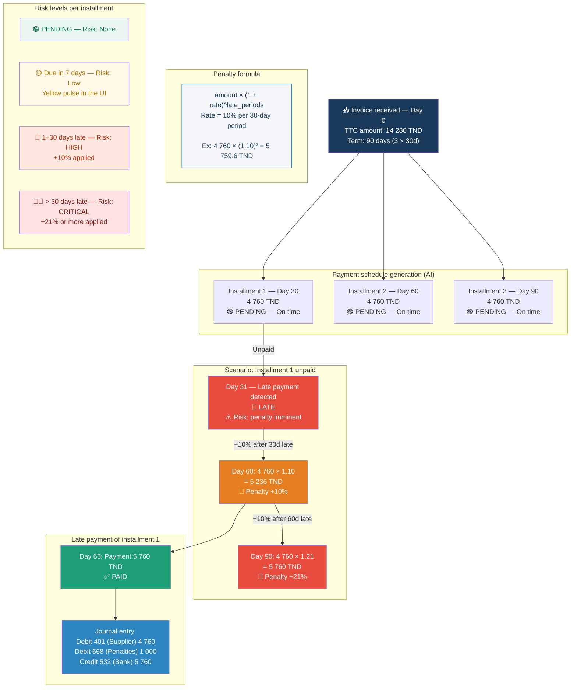

# Diagram 15 — Workflow: Payment Schedule and Late Penalties (with risk column)

**Updated 2026-07-16** — translated to English.

# Paste into Eraser → New Diagram → Flowchart

## Risk summary table per period

| Day | Installment | Amount | Status | Risk level | System action |
|------|----------|---------|--------|-----------------|----------------|
| D+30 | 1 | 4 760 TND | PENDING | 🟢 None | — |
| D+37 | 1 | 4 760 TND | LATE | 🔴 HIGH | Accountant alert |
| D+60 | 1 | 5 236 TND | LATE +10% | 🔴 CRITICAL | Penalty applied |
| D+90 | 1 | 5 760 TND | LATE +21% | 🔴 CRITICAL | Compounded penalty |
| D+65 | 1 | 5 760 TND | PAID | ✅ Settled | Entry 401/668/532 |
| D+60 | 2 | 4 760 TND | PENDING | 🟢 None | — |
| D+90 | 3 | 4 760 TND | PENDING | 🟢 None | — |

> **Rule**: Each 30-day period of delay = +10% cumulative on the affected installment.
> Recalculated automatically every night by the APScheduler scheduler.
