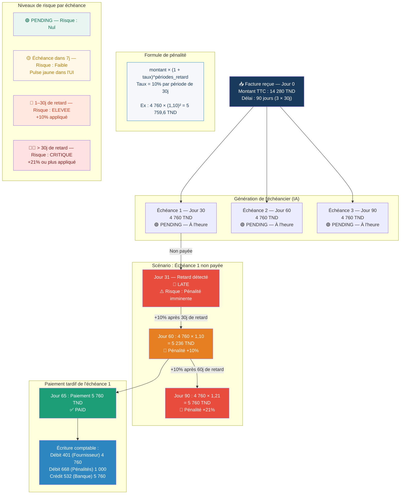

# Diagram 15 — Workflow : Échéancier et Pénalités de Retard (avec colonne risque)
# Paste into Eraser → New Diagram → Flowchart

## Tableau récapitulatif des risques par période

| Jour | Échéance | Montant | Statut | Niveau de risque | Action système |
|------|----------|---------|--------|-----------------|----------------|
| J+30 | 1 | 4 760 TND | PENDING | 🟢 Nul | — |
| J+37 | 1 | 4 760 TND | LATE | 🔴 ÉLEVÉ | Alerte comptable |
| J+60 | 1 | 5 236 TND | LATE +10% | 🔴 CRITIQUE | Pénalité appliquée |
| J+90 | 1 | 5 760 TND | LATE +21% | 🔴 CRITIQUE | Pénalité compoundée |
| J+65 | 1 | 5 760 TND | PAID | ✅ Soldée | Écriture 401/668/532 |
| J+60 | 2 | 4 760 TND | PENDING | 🟢 Nul | — |
| J+90 | 3 | 4 760 TND | PENDING | 🟢 Nul | — |

> **Règle** : Chaque période de 30 jours de retard = +10% cumulatif sur l'échéance concernée.
> Recalcul automatique chaque nuit par le scheduler APScheduler.
