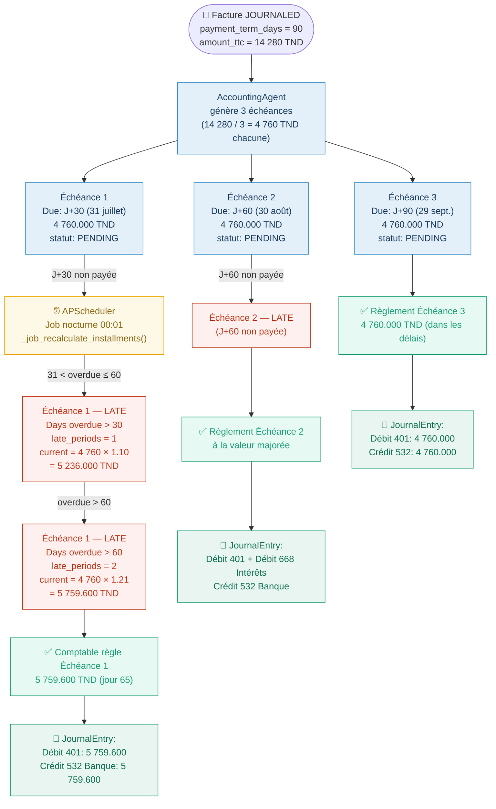

# Diagram 15 — Payment Schedule with Late Penalties
# Paste into Eraser → New Diagram → Flowchart

```mermaid
flowchart TB
  classDef pending fill:#E3F0F9,stroke:#2E86C1,color:#1A3A5C
  classDef late fill:#FEF0EE,stroke:#C0391B,color:#C0391B
  classDef paid fill:#E6F9F3,stroke:#1D9E76,color:#1D9E76
  classDef journal fill:#E8F5F0,stroke:#1D9E76,color:#0D6E52
  classDef scheduler fill:#FEF9E7,stroke:#F0A500,color:#8B6914

  START(["📄 Facture JOURNALED\npayment_term_days = 90\namount_ttc = 14 280 TND"])

  GEN["AccountingAgent\ngénère 3 échéances\n(14 280 / 3 = 4 760 TND chacune)"]:::pending

  I1["Échéance 1\nDue: J+30 (31 juillet)\n4 760.000 TND\nstatut: PENDING"]:::pending
  I2["Échéance 2\nDue: J+60 (30 août)\n4 760.000 TND\nstatut: PENDING"]:::pending
  I3["Échéance 3\nDue: J+90 (29 sept.)\n4 760.000 TND\nstatut: PENDING"]:::pending

  CRON["⏰ APScheduler\nJob nocturne 00:01\n_job_recalculate_installments()"]:::scheduler

  LATE1["Échéance 1 — LATE\nDays overdue > 30\nlate_periods = 1\ncurrent = 4 760 × 1.10\n= 5 236.000 TND"]:::late
  LATE2["Échéance 1 — LATE\nDays overdue > 60\nlate_periods = 2\ncurrent = 4 760 × 1.21\n= 5 759.600 TND"]:::late

  PAY1["✅ Comptable règle Échéance 1\n5 759.600 TND (jour 65)"]:::paid
  J1["📒 JournalEntry:\nDébit 401: 5 759.600\nCrédit 532 Banque: 5 759.600"]:::journal

  LATE_I2["Échéance 2 — LATE\n(J+60 non payée)"]:::late
  PAY2["✅ Règlement Échéance 2\nà la valeur majorée"]:::paid
  J2["📒 JournalEntry:\nDébit 401 + Débit 668 Intérêts\nCrédit 532 Banque"]:::journal

  PAY3["✅ Règlement Échéance 3\n4 760.000 TND (dans les délais)"]:::paid
  J3["📒 JournalEntry:\nDébit 401: 4 760.000\nCrédit 532: 4 760.000"]:::journal

  START --> GEN
  GEN --> I1 & I2 & I3

  I1 -->|"J+30 non payée"| CRON
  CRON -->|"31 < overdue ≤ 60"| LATE1
  LATE1 -->|"overdue > 60"| LATE2
  LATE2 --> PAY1 --> J1

  I2 -->|"J+60 non payée"| LATE_I2
  LATE_I2 --> PAY2 --> J2

  I3 --> PAY3 --> J3
```
