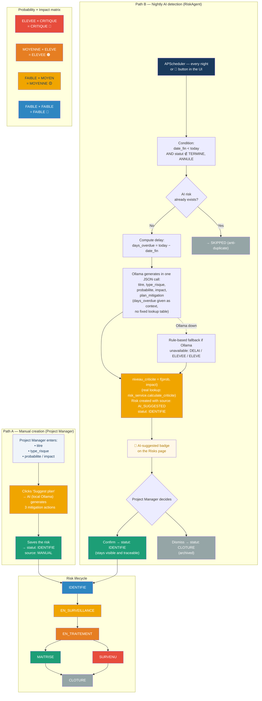

# Diagram 16 — Workflow: Risk Management (with delay risks)

**Updated 2026-07-16** — translated to English, and fixed a fabricated
detail: the previous version showed a deterministic lookup table
(days-overdue → probability, milestone priority → impact) for the AI
path. The actual code (`RiskAgent._generate_risk_for_overdue()`) has no
such table — it asks Ollama to freely generate `probabilite`/`impact`/
`type_risque`/`plan_mitigation` in a single JSON completion, only passing
`days_overdue` as context in the prompt. `niveau_criticite = f(prob,
impact)` (a real deterministic lookup, `risk_service.calculate_criticite()`)
is the only part of this flow that is actually rule-based.

# Paste into Eraser → New Diagram → Flowchart

## How the automatic path actually decides (Path B — RiskAgent)

`probabilite`, `impact`, `type_risque`, and `plan_mitigation` are all
generated by Ollama in a single JSON completion — `days_overdue` is passed
as free-text context in the prompt, not looked up in a table. If Ollama is
unavailable, a fixed fallback (`DELAI` / `ELEVEE` / `ELEVE`) is used
instead. The only genuinely deterministic step is:

`niveau_criticite = calculate_criticite(probabilite, impact)` — a real
lookup table in `src/services/risk_service.py`.

> Anti-duplicate: if a risk with `source=AI_SUGGESTED` and `statut=IDENTIFIE`
> already exists for this milestone, the AI does not create a duplicate.
