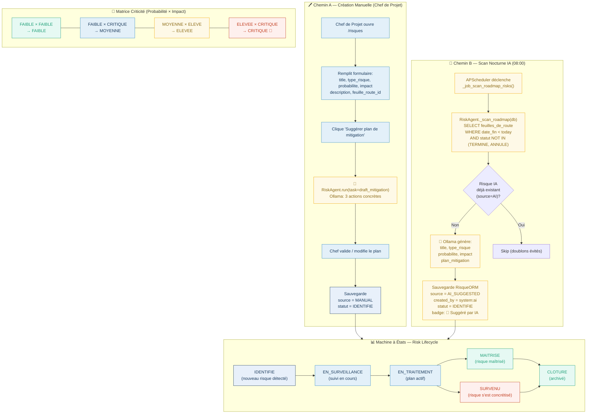

# Diagram 16 — Risk Management Workflow
# Paste into Eraser → New Diagram → Flowchart

```mermaid
flowchart TB
  classDef manual fill:#E3F0F9,stroke:#2E86C1,color:#1A3A5C
  classDef ai fill:#FEF9E7,stroke:#F0A500,color:#8B6914
  classDef status_id fill:#E8F0FA,stroke:#1A3A5C,color:#1A3A5C
  classDef status_ok fill:#E6F9F3,stroke:#1D9E76,color:#1D9E76
  classDef status_bad fill:#FEF0EE,stroke:#C0391B,color:#C0391B
  classDef matrix fill:#F5F7FA,stroke:#5D6D7E,color:#1A3A5C

  %% ── PATH A — Manual ─────────────────────────────────
  subgraph PA["🖊️ Chemin A — Création Manuelle (Chef de Projet)"]
    A1["Chef de Projet ouvre /risques"]:::manual
    A2["Remplit formulaire:\ntitle, type_risque, probabilite, impact\ndescription, feuille_route_id"]:::manual
    A3["Clique 'Suggérer plan de mitigation'"]:::manual
    A4["🤖 RiskAgent.run(task=draft_mitigation)\nOllama: 3 actions concrètes"]:::ai
    A5["Chef valide / modifie le plan"]:::manual
    A6["Sauvegarde\nsource = MANUAL\nstatut = IDENTIFIE"]:::status_id
  end

  %% ── PATH B — AI Nightly ──────────────────────────────
  subgraph PB["🤖 Chemin B — Scan Nocturne IA (08:00)"]
    B1["APScheduler déclenche\n_job_scan_roadmap_risks()"]:::ai
    B2["RiskAgent._scan_roadmap(db)\nSELECT feuilles_de_route\nWHERE date_fin < today\nAND statut NOT IN (TERMINE, ANNULE)"]:::ai
    B3{"Risque IA\ndéjà existant\n(source=AI)?"}
    B4["🤖 Ollama génère:\ntitle, type_risque\nprobabilite, impact\nplan_mitigation"]:::ai
    B5["Sauvegarde RisqueORM\nsource = AI_SUGGESTED\ncreated_by = system:ai\nstatut = IDENTIFIE\nbadge: 🤖 Suggéré par IA"]:::ai
    B6["Skip (doublons évités)"]
  end

  %% ── STATUS MACHINE ────────────────────────────────────
  subgraph SM["📊 Machine à États — Risk Lifecycle"]
    S1["IDENTIFIE\n(nouveau risque détecté)"]:::status_id
    S2["EN_SURVEILLANCE\n(suivi en cours)"]:::manual
    S3["EN_TRAITEMENT\n(plan actif)"]:::manual
    S4["MAITRISE\n(risque maîtrisé)"]:::status_ok
    S5["SURVENU\n(risque s'est concrétisé)"]:::status_bad
    S6["CLOTURE\n(archivé)"]:::status_ok
    S1 --> S2 --> S3 --> S4 --> S6
    S3 --> S5 --> S6
  end

  %% ── CRITICITE MATRIX ─────────────────────────────────
  subgraph MX["📐 Matrice Criticité (Probabilité × Impact)"]
    direction LR
    MX1["FAIBLE × FAIBLE\n→ FAIBLE"]:::status_ok
    MX2["FAIBLE × CRITIQUE\n→ MOYENNE"]:::manual
    MX3["MOYENNE × ELEVE\n→ ELEVEE"]:::ai
    MX4["ELEVEE × CRITIQUE\n→ CRITIQUE 🔴"]:::status_bad
    MX1 --- MX2 --- MX3 --- MX4
  end

  %% ── CONNECTIONS ──────────────────────────────────────
  A1 --> A2 --> A3 --> A4 --> A5 --> A6 --> SM
  B1 --> B2 --> B3
  B3 -->|"Non"| B4 --> B5 --> SM
  B3 -->|"Oui"| B6
```
