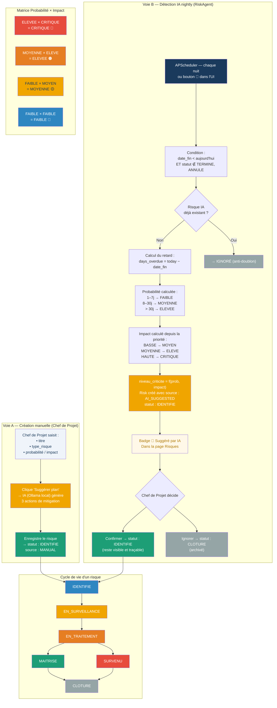

# Diagram 16 — Workflow : Gestion des Risques (avec risques de retard)
# Paste into Eraser → New Diagram → Flowchart

## Logique de calcul automatique (voie B — RiskAgent)

| Jours de retard | Probabilité assignée | Impact (HAUTE) | Criticité résultante |
|----------------|---------------------|----------------|---------------------|
| 1–7 jours | FAIBLE | CRITIQUE | MOYENNE |
| 8–30 jours | MOYENNE | CRITIQUE | ELEVEE |
| > 30 jours | ELEVEE | CRITIQUE | CRITIQUE |
| 1–7 jours | FAIBLE | MOYEN (BASSE) | FAIBLE |
| 8–30 jours | MOYENNE | ELEVE (MOYENNE) | ELEVEE |

> L'impact est déduit de la **priorité du jalon** : BASSE → MOYEN, MOYENNE → ELEVE, HAUTE → CRITIQUE.
> Anti-doublon : si un risque `source=AI_SUGGESTED` et `statut=IDENTIFIE` existe déjà pour ce jalon, l'IA ne crée pas de doublon.
