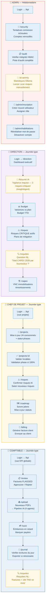

# Diagram 17 — Functional Flow per Role (Daily Workflow)
# Paste into Eraser → New Diagram → Flowchart

```mermaid
flowchart LR
  classDef comptable fill:#1A3A5C,color:#fff,stroke:none
  classDef chef fill:#F0A500,color:#fff,stroke:none
  classDef direction fill:#804CD7,color:#fff,stroke:none
  classDef admin fill:#C0391B,color:#fff,stroke:none
  classDef action fill:#E3F0F9,color:#1A3A5C,stroke:#2E86C1
  classDef ai fill:#FEF9E7,color:#8B6914,stroke:#F0A500

  %% ── COMPTABLE ─────────────────────────────────────────
  subgraph SC["👤 COMPTABLE — Journée type"]
    C0["Login → /kpi\n(vue KPI globale)"]:::action
    C1["📋 /review\nFactures FLAGGED\nApprouver / Rejeter"]:::action
    C2["📤 /upload\nNouveaux PDFs\n→ Pipeline IA (4 agents)"]:::action
    C3["💳 /suivi\nÉchéances en retard\nMarquer payées"]:::action
    C4["📒 /journal\nVérifier écritures du jour\nExporter si nécessaire"]:::action
    C5["🔍 /requetes\nRequêtes NL:\n'Factures > 10k TND ce mois'"]:::ai
    C0 --> C1 --> C2 --> C3 --> C4 --> C5
  end

  %% ── CHEF DE PROJET ─────────────────────────────────────
  subgraph SCP["👤 CHEF DE PROJET — Journée type"]
    P0["Login → /kpi\n(vue projets)"]:::action
    P1["📂 /projects\nMise à jour JH consommés\n+ statut phases"]:::action
    P2["✅ /projects/:id\nValider livrables\nValidation phase si 100%"]:::action
    P3["⚠️ /risques\nConfirmer risques IA\nSaisir nouveaux risques"]:::action
    P4["🗺️ /roadmap\nSuivre jalons\nMise à jour statuts"]:::action
    P5["🧾 /billing\nGénérer facture client\nEnvoyer au client"]:::action
    P0 --> P1 --> P2 --> P3 --> P4 --> P5
  end

  %% ── DIRECTION ─────────────────────────────────────────
  subgraph SD["👤 DIRECTION — Journée type"]
    D0["Login → /direction\nDashboard exécutif"]:::action
    D1["🤖 Résumé IA\n'Vigilance requise — 3 risques critiques'\n(InsightAgent)"]:::ai
    D2["📊 /budget\nVariances vs plan\nBudget YTD"]:::action
    D3["⚠️ /risques\nRisques CRITIQUE actifs\nPlans de mitigation"]:::action
    D4["🔍 /requetes\nQuestion NL:\n'Total CAPEX 2026 par fournisseur ?'"]:::ai
    D5["🏗️ /capex\nVNC immobilisations\nAmortissements"]:::action
    D0 --> D1 --> D2 --> D3 --> D4 --> D5
  end

  %% ── ADMIN ─────────────────────────────────────────────
  subgraph SA["👤 ADMIN — Hebdomadaire"]
    A0["Login → /kpi"]:::action
    A1["🔐 /security\nTentatives connexion échouées\nComptes verrouillés"]:::action
    A2["📋 /audit\nVérifier intégrité HMAC\nPiste d'audit complète"]:::action
    A3["🤖 /ai-activity\nStatistiques Ollama\nLancer scan risques manuellement"]:::ai
    A4["👥 /admin/inscription\nCréer nouvel utilisateur\nAssigner rôle"]:::action
    A5["🔑 /admin/habilitations\nRéinitialiser mot de passe\nDésactiver compte"]:::action
    A0 --> A1 --> A2 --> A3 --> A4 --> A5
  end

  style SC fill:#E8F0FA,stroke:#1A3A5C
  style SCP fill:#FEF9E7,stroke:#F0A500
  style SD fill:#F3EEF9,stroke:#804CD7
  style SA fill:#FEF0EE,stroke:#C0391B
```
