# Diagram 17 — Daily Workflow per Role (risk-aware)

**Updated 2026-07-16** — translated to English.

# Paste into Eraser → New Diagram → Flowchart

```mermaid
flowchart LR

  subgraph COMPT["🧾 ACCOUNTANT — Morning"]
    C1["Logs in\n→ Invoice dashboard"]
    C2["📋 Review queue\n(FLAGGED invoices)"]
    C3["📤 Uploads new\ninvoice PDFs"]
    C4["📅 Payment schedule\n→ Late payments & penalties?"]
    C5["📒 Export PCE journal"]
    C6["⚠️ Risk alerts:\n• Invoices FLAGGED > 3d?\n• Late payment detected?\n• +10% penalty imminent?"]
    C1 --> C2 --> C3 --> C4 --> C5
    C4 --- C6
  end

  subgraph CP["📁 PROJECT MANAGER — Morning"]
    P1["Logs in\n→ Projects dashboard"]
    P2["📊 Phase progress\n→ Update person-days"]
    P3["🚩 AI-suggested risks\n→ Confirm / Dismiss"]
    P4["🗺️ Roadmap\n→ Overdue milestones?"]
    P5["📄 Client invoices\n→ Statuses & reminders"]
    P6["⚠️ Risk alerts:\n• Overdue milestone → AI DELAI risk?\n• Project line over budget?\n• Deliverable not delivered?"]
    P1 --> P2 --> P3 --> P4 --> P5
    P4 --- P6
  end

  subgraph DIR["📊 DIRECTION — Morning"]
    D1["Logs in\n→ Executive KPIs"]
    D2["🤖 AI summary\n(InsightAgent)"]
    D3["🔴 Critical risks\nunaddressed?"]
    D4["📈 Budget variance\nvs plan?"]
    D5["📋 CAPEX / OPEX\nYTD breakdown"]
    D6["⚠️ Risk alerts:\n• CRITICAL risks unaddressed?\n• KPI degraded vs last week?\n• Invoices > 30d unpaid?"]
    D1 --> D2 --> D3 --> D4 --> D5
    D3 --- D6
  end

  subgraph ADM["🔐 ADMIN — Weekly"]
    A1["Logs in\n→ Security dashboard"]
    A2["🔒 Failed login\nattempts?"]
    A3["🔍 Audit integrity\ncheck (HMAC)"]
    A4["👤 Create user\nif needed"]
    A5["📋 Weekly activity\nreport"]
    A6["⚠️ Risk alerts:\n• Account locked (> 5 failures)?\n• Invalid audit hash?\n• Inactive user with active access?"]
    A1 --> A2 --> A3 --> A4 --> A5
    A2 --- A6
  end

  style C6 fill:#FFF8E8,color:#7D4E00,stroke:#F0A500,stroke-width:2px
  style P6 fill:#FFF8E8,color:#7D4E00,stroke:#F0A500,stroke-width:2px
  style D6 fill:#FEE2E2,color:#7F1D1D,stroke:#E74C3C,stroke-width:2px
  style A6 fill:#FEE2E2,color:#7F1D1D,stroke:#E74C3C,stroke-width:2px

  style C1 fill:#1A3A5C,color:#FFFFFF
  style P1 fill:#1A3A5C,color:#FFFFFF
  style D1 fill:#1A3A5C,color:#FFFFFF
  style A1 fill:#1A3A5C,color:#FFFFFF
```

## Vigilance questions per role

### ACCOUNTANT
- Invoices FLAGGED for more than 3 days with no action?
- Late payment detected → +10% penalty imminent?
- Duplicate invoice unresolved in the queue?

### PROJECT MANAGER
- Overdue milestones → has an AI DELAI risk been suggested?
- Budget exceeded on a project line?
- Deliverable marked "pending" for > 7 days?

### DIRECTION
- CRITICAL-severity risks unaddressed for > 5 days?
- Auto-approval rate KPI trending down vs last week?
- Supplier invoices > 30 days unpaid (litigation risk)?

### ADMIN
- Account locked after 5 attempts → compromised access?
- Invalid HMAC hash in the audit_logs table → tampering attempt?
- Deactivated user with a still-active refresh token?
