# Diagram 17 — Flux par Rôle (avec conscience des risques)
# Paste into Eraser → New Diagram → Flowchart

```mermaid
flowchart LR

  subgraph COMPT["🧾 COMPTABLE — Matin"]
    C1["Se connecte\n→ Dashboard factures"]
    C2["📋 File de révision\n(factures FLAGGED)"]
    C3["📤 Upload nouvelles\nfactures PDF"]
    C4["📅 Échéancier\n→ Retards & pénalités ?"]
    C5["📒 Export journal PCE"]
    C6["⚠️ Alertes risques :\n• Factures FLAGGED > 3j ?\n• Retard de paiement détecté ?\n• Pénalité +10% imminente ?"]
    C1 --> C2 --> C3 --> C4 --> C5
    C4 --- C6
  end

  subgraph CP["📁 CHEF DE PROJET — Matin"]
    P1["Se connecte\n→ Dashboard projets"]
    P2["📊 Avancement phases\n→ Mise à jour JH"]
    P3["🚩 Risques IA suggérés\n→ Confirmer / Ignorer"]
    P4["🗺️ Feuille de route\n→ Jalons en retard ?"]
    P5["📄 Factures client\n→ Statuts & relances"]
    P6["⚠️ Alertes risques :\n• Jalons en retard → risques DELAI IA ?\n• Budget ligne dépassé ?\n• Livrable non livré ?"]
    P1 --> P2 --> P3 --> P4 --> P5
    P4 --- P6
  end

  subgraph DIR["📊 DIRECTION — Matin"]
    D1["Se connecte\n→ KPI exécutif"]
    D2["🤖 Résumé IA\n(InsightAgent)"]
    D3["🔴 Risques critiques\nnon traités ?"]
    D4["📈 Variances budget\nvs plan ?"]
    D5["📋 CAPEX / OPEX\nrépartition YTD"]
    D6["⚠️ Alertes risques :\n• Risques CRITIQUE non traités ?\n• KPI dégradé vs semaine précédente ?\n• Factures > 30j sans paiement ?"]
    D1 --> D2 --> D3 --> D4 --> D5
    D3 --- D6
  end

  subgraph ADM["🔐 ADMIN — Hebdomadaire"]
    A1["Se connecte\n→ Dashboard sécurité"]
    A2["🔒 Tentatives\nde connexion échouées ?"]
    A3["🔍 Vérification intégrité\naudit (HMAC)"]
    A4["👤 Créer utilisateur\nsi besoin"]
    A5["📋 Rapport activité\nde la semaine"]
    A6["⚠️ Alertes risques :\n• Compte verrouillé (> 5 échecs) ?\n• Hash d'audit invalide ?\n• Utilisateur inactif avec accès actif ?"]
    A1 --> A2 --> A3 --> A4 --> A5
    A2 --- A6
  end

  style C6 fill:#FFF8E8,color:#7D4E00,stroke:#F0A500,stroke-width:2px
  style P6 fill:#FFF8E8,color:#7D4E00,stroke:#F0A500,stroke-width:2px
  style D6 fill:#FEE2E2,color:#7F1D1D,stroke:#E74C3C,stroke-width:2px
  style A6 fill:#FEE2E2,color:#7F1D1D,stroke:#E74C3C,stroke-width:2px

  style C1 fill:#1A3A5C,color:#FFFFFF
  style P1 fill:#1A3A5C,color:#FFFFFF
  style D1 fill:#1A3A5C,color:#FFFFFF
  style A1 fill:#1A3A5C,color:#FFFFFF
```

## Questions de vigilance par rôle

### COMPTABLE
- Factures FLAGGED depuis plus de 3 jours sans action ?
- Retard de paiement détecté → pénalité +10% imminente ?
- Facture dupliquée non résolue dans la file ?

### CHEF DE PROJET
- Jalons en retard → un risque DELAI IA a-t-il été suggéré ?
- Budget dépassé sur une ligne de projet ?
- Livrable marqué "en attente" depuis > 7 jours ?

### DIRECTION
- Risques de criticité CRITIQUE non traités depuis > 5 jours ?
- KPI de taux d'auto-approbation en baisse vs semaine précédente ?
- Factures fournisseurs > 30j sans paiement (risque contentieux) ?

### ADMIN
- Compte verrouillé après 5 tentatives → accès compromis ?
- Hash HMAC invalide dans la table audit_logs → tentative de falsification ?
- Utilisateur désactivé mais token refresh encore actif ?
