# Diagram 18 — Risks Embedded in Each Business Process

**Updated 2026-07-16** — translated to English.

# Paste into Eraser → New Diagram → Flowchart

```mermaid
flowchart TB

  subgraph P1["📥 Process 1 — Supplier Invoice Processing"]
    direction LR
    F1["PDF received"] --> F2["OCR+LLM extraction"]
    F2 --> F3["PCE classification"]
    F3 --> F4["AnomalyAgent validation"]
    F4 --> F5["Journal entry"]
    F5 --> F6["Payment"]

    R1A["⚠️ Extraction fails\n→ Tesseract OCR fallback\n→ On failure: EXTRACTION_FAILED"]
    R1B["⚠️ Incorrect classification\n→ Confidence < 85%\n→ Human review (FLAGGED)"]
    R1C["⚠️ Anomaly detected\n→ Math / duplicate / amount\n→ Review queue"]
    R1D["⚠️ Unbalanced entry\n→ Automatically blocked\n→ Error raised before save"]
    R1E["⚠️ Late payment\n→ +10%/30d penalty\n→ Nightly alert"]

    F2 --- R1A
    F3 --- R1B
    F4 --- R1C
    F5 --- R1D
    F6 --- R1E
  end

  subgraph P2["📁 Process 2 — Project Management"]
    direction LR
    G1["Charter creation"] --> G2["Phases & deliverables"]
    G2 --> G3["Person-day progress tracking"]
    G3 --> G4["Phase validation"]
    G4 --> G5["Project closure"]

    R2A["⚠️ Phase delayed\n→ RiskAgent creates DELAI risk\n→ AI badge in UI"]
    R2B["⚠️ Project line over budget\n→ Red-line alert\n→ Visible in dashboard"]
    R2C["⚠️ Deliverable not delivered\n→ Phase blocked\n→ Project Manager notified"]
    R2D["⚠️ Resource unavailable\n→ Manual RESSOURCE risk\n→ AI mitigation plan"]

    G3 --- R2A
    G3 --- R2B
    G2 --- R2C
    G2 --- R2D
  end

  subgraph P3["📄 Process 3 — Client Billing"]
    direction LR
    C1["Phase validated"] --> C2["Invoice line entry"]
    C2 --> C3["PDF generation (AI)"]
    C3 --> C4["Sent to client"]
    C4 --> C5["Collection"]

    R3A["⚠️ Phase not validated\n→ Invoice not generated\n→ Logical block"]
    R3B["⚠️ Person-day budget exceeded\n→ Project Manager alerted\n→ Billing to review"]
    R3C["⚠️ Invoice unpaid\n→ Overdue receivable\n→ Visible in Tracking"]

    C1 --- R3A
    C2 --- R3B
    C5 --- R3C
  end

  subgraph P4["🏗️ Process 4 — CAPEX Assets"]
    direction LR
    I1["CAPEX invoice received"] --> I2["AI suggests depreciation period"]
    I2 --> I3["Accountant validates period"]
    I3 --> I4["Asset created in DB"]
    I4 --> I5["Monthly depreciation charge\n(6811/28xx)"]

    R4A["⚠️ Wrong depreciation period\n→ AI suggests, human validates\n→ No automatic validation"]
    R4B["⚠️ Asset not created\n→ Consistency check\n→ Alert if CAPEX without asset"]
    R4C["⚠️ Wrong PCE account\n→ 2184 vs 6xxx\n→ Classification validation"]

    I2 --- R4A
    I4 --- R4B
    I1 --- R4C
  end

  style R1A fill:#FFF8E8,color:#7D4E00,stroke:#F0A500,stroke-width:2px
  style R1B fill:#FFF8E8,color:#7D4E00,stroke:#F0A500,stroke-width:2px
  style R1C fill:#FFF8E8,color:#7D4E00,stroke:#F0A500,stroke-width:2px
  style R1D fill:#FEE2E2,color:#7F1D1D,stroke:#E74C3C,stroke-width:2px
  style R1E fill:#FFF8E8,color:#7D4E00,stroke:#F0A500,stroke-width:2px
  style R2A fill:#FFF8E8,color:#7D4E00,stroke:#F0A500,stroke-width:2px
  style R2B fill:#FEE2E2,color:#7F1D1D,stroke:#E74C3C,stroke-width:2px
  style R2C fill:#FFF8E8,color:#7D4E00,stroke:#F0A500,stroke-width:2px
  style R2D fill:#FFF8E8,color:#7D4E00,stroke:#F0A500,stroke-width:2px
  style R3A fill:#FEE2E2,color:#7F1D1D,stroke:#E74C3C,stroke-width:2px
  style R3B fill:#FFF8E8,color:#7D4E00,stroke:#F0A500,stroke-width:2px
  style R3C fill:#FFF8E8,color:#7D4E00,stroke:#F0A500,stroke-width:2px
  style R4A fill:#FFF8E8,color:#7D4E00,stroke:#F0A500,stroke-width:2px
  style R4B fill:#FEE2E2,color:#7F1D1D,stroke:#E74C3C,stroke-width:2px
  style R4C fill:#FFF8E8,color:#7D4E00,stroke:#F0A500,stroke-width:2px

  style F1 fill:#1A3A5C,color:#FFFFFF
  style G1 fill:#1A3A5C,color:#FFFFFF
  style C1 fill:#1A3A5C,color:#FFFFFF
  style I1 fill:#1A3A5C,color:#FFFFFF
```

## Risk summary per process

| Process | Risk | Criticality | Mitigation |
|-----------|--------|-----------|------------|
| Invoices | Extraction fails | HIGH | OCR fallback → EXTRACTION_FAILED |
| Invoices | Wrong PCE account | MEDIUM | Confidence threshold → human review |
| Invoices | Anomaly detected | HIGH | AnomalyAgent → review queue |
| Invoices | Unbalanced entry | CRITICAL | Auto-blocked before save |
| Invoices | Late payment | HIGH | +10%/30d, nightly alerts |
| Projects | Milestone delayed | VARIABLE | RiskAgent auto-creates DELAI risk |
| Projects | Budget exceeded | HIGH | Dashboard red-line alert |
| Projects | Deliverable not delivered | MEDIUM | Phase blocked, notification |
| Client billing | Phase not validated | HIGH | Logical block — invoice impossible |
| Client billing | Invoice unpaid | MEDIUM | Receivables tracking, reminders |
| CAPEX | Wrong depreciation period | HIGH | Mandatory human validation |
| CAPEX | Asset not created | CRITICAL | CAPEX/asset consistency check |

> Color legend:
> 🟡 Amber (#F0A500) = HIGH risk — vigilance required
> 🔴 Red (#E74C3C) = CRITICAL risk — automatic block or penalty
