# Diagram 18 — Risques Embarqués dans Chaque Processus Métier (NOUVEAU)
# Paste into Eraser → New Diagram → Flowchart

```mermaid
flowchart TB

  subgraph P1["📥 Processus 1 — Traitement des Factures Fournisseurs"]
    direction LR
    F1["PDF reçu"] --> F2["Extraction OCR+LLM"]
    F2 --> F3["Classification PCE"]
    F3 --> F4["Validation AnomalyAgent"]
    F4 --> F5["Écriture comptable"]
    F5 --> F6["Paiement"]

    R1A["⚠️ Extraction échoue\n→ Fallback OCR Tesseract\n→ Si échec : EXTRACTION_FAILED"]
    R1B["⚠️ Classification incorrecte\n→ Confiance < 85%\n→ Révision humaine (FLAGGED)"]
    R1C["⚠️ Anomalie détectée\n→ Math / Doublon / Montant\n→ File de révision"]
    R1D["⚠️ Écriture déséquilibrée\n→ Bloquage automatique\n→ Erreur levée avant sauvegarde"]
    R1E["⚠️ Retard de paiement\n→ Pénalité +10%/30j\n→ Alerte nightly"]

    F2 --- R1A
    F3 --- R1B
    F4 --- R1C
    F5 --- R1D
    F6 --- R1E
  end

  subgraph P2["📁 Processus 2 — Gestion de Projets"]
    direction LR
    G1["Création charte"] --> G2["Phases & livrables"]
    G2 --> G3["Suivi avancement JH"]
    G3 --> G4["Validation phase"]
    G4 --> G5["Clôture projet"]

    R2A["⚠️ Retard de phase\n→ RiskAgent crée risque DELAI\n→ Badge IA dans UI"]
    R2B["⚠️ Budget ligne dépassé\n→ Alerte ligne rouge\n→ Visible dans Dashboard"]
    R2C["⚠️ Livrable non livré\n→ Phase bloquée\n→ Notification Chef Projet"]
    R2D["⚠️ Ressource indisponible\n→ Risque RESSOURCE manuel\n→ Plan mitigation IA"]

    G3 --- R2A
    G3 --- R2B
    G2 --- R2C
    G2 --- R2D
  end

  subgraph P3["📄 Processus 3 — Facturation Client"]
    direction LR
    C1["Phase validée"] --> C2["Saisie lignes facture"]
    C2 --> C3["Génération PDF (IA)"]
    C3 --> C4["Envoi client"]
    C4 --> C5["Encaissement"]

    R3A["⚠️ Phase non validée\n→ Facture non générée\n→ Blocage logique"]
    R3B["⚠️ Budget JH dépassé\n→ Alerte Chef Projet\n→ Facturation à revoir"]
    R3C["⚠️ Facture non payée\n→ Créance en retard\n→ Visible dans Suivi"]

    C1 --- R3A
    C2 --- R3B
    C5 --- R3C
  end

  subgraph P4["🏗️ Processus 4 — Immobilisations CAPEX"]
    direction LR
    I1["Facture CAPEX reçue"] --> I2["IA suggère durée amort."]
    I2 --> I3["Comptable valide durée"]
    I3 --> I4["Actif créé en DB"]
    I4 --> I5["Dotation amortissement\nmensuelle (6811/28xx)"]

    R4A["⚠️ Durée amort. incorrecte\n→ IA suggère, humain valide\n→ Pas de validation automatique"]
    R4B["⚠️ Actif non créé\n→ Vérification cohérence\n→ Alerte si CAPEX sans actif"]
    R4C["⚠️ Compte PCE erroné\n→ 2184 vs 6xxx\n→ Validation classification"]

    I2 --- R4A
    I4 --- R4B
    I1 --- R4C
  end

  style R1A fill:#FFF8E8,color:#7D4E00,stroke:#F0A500,stroke-width:2px
  style R1B fill:#FFF8E8,color:#7D4E00,stroke:#F0A500,stroke-width:2px
  style R1C fill:#FFF8E8,color:#7D4E00,stroke:#F0A500,stroke-width:2px
  style R1D fill:#FEE2E2,color:#7F1D1D,stroke:#E74C3C,stroke-width:2px
  style R1E fill:#FFF8E8,color:#7D4E00,stroke:#F0A500,stroke-width:2px
  style R2A fill:#FFF8E8,color:#7D4E00,stroke:#F0A500,stroke-width:2px
  style R2B fill:#FEE2E2,color:#7F1D1D,stroke:#E74C3C,stroke-width:2px
  style R2C fill:#FFF8E8,color:#7D4E00,stroke:#F0A500,stroke-width:2px
  style R2D fill:#FFF8E8,color:#7D4E00,stroke:#F0A500,stroke-width:2px
  style R3A fill:#FEE2E2,color:#7F1D1D,stroke:#E74C3C,stroke-width:2px
  style R3B fill:#FFF8E8,color:#7D4E00,stroke:#F0A500,stroke-width:2px
  style R3C fill:#FFF8E8,color:#7D4E00,stroke:#F0A500,stroke-width:2px
  style R4A fill:#FFF8E8,color:#7D4E00,stroke:#F0A500,stroke-width:2px
  style R4B fill:#FEE2E2,color:#7F1D1D,stroke:#E74C3C,stroke-width:2px
  style R4C fill:#FFF8E8,color:#7D4E00,stroke:#F0A500,stroke-width:2px

  style F1 fill:#1A3A5C,color:#FFFFFF
  style G1 fill:#1A3A5C,color:#FFFFFF
  style C1 fill:#1A3A5C,color:#FFFFFF
  style I1 fill:#1A3A5C,color:#FFFFFF
```

## Synthèse des risques par processus

| Processus | Risque | Criticité | Mitigation |
|-----------|--------|-----------|------------|
| Factures | Extraction échoue | ELEVEE | Fallback OCR → EXTRACTION_FAILED |
| Factures | Compte PCE erroné | MOYENNE | Seuil confiance → révision humaine |
| Factures | Anomalie détectée | ELEVEE | AnomalyAgent → file de révision |
| Factures | Écriture déséquilibrée | CRITIQUE | Bloquage auto avant sauvegarde |
| Factures | Retard paiement | ELEVEE | +10%/30j, alertes nightly |
| Projets | Retard de jalon | VARIABLE | RiskAgent crée risque DELAI auto |
| Projets | Budget dépassé | ELEVEE | Alerte ligne rouge dashboard |
| Projets | Livrable non livré | MOYENNE | Blocage phase, notification |
| Facturation client | Phase non validée | ELEVEE | Blocage logique — facture impossible |
| Facturation client | Facture impayée | MOYENNE | Suivi créances, relance |
| CAPEX | Durée amort. incorrecte | ELEVEE | Validation humaine obligatoire |
| CAPEX | Actif non créé | CRITIQUE | Contrôle cohérence CAPEX/actifs |

> Légende couleurs :
> 🟡 Amber (#F0A500) = risque ELEVEE — vigilance requise
> 🔴 Rouge (#E74C3C) = risque CRITIQUE — bloquage ou pénalité automatique
